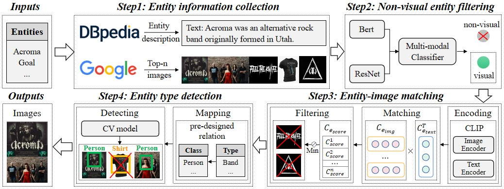

# MMpedia
This is the official github repository for the paper "MMpedia: A Large-scale Multi-modal Knowledge Graph".

We presented our implementation of MMpedia's construction pipeline and the experiments, and released the MMpedia dataset.

## Contents

- [MMpedia](#MMpedia)
  - [Contents](#contents)
  - [Overview](#overview)
  - [Download](#download)
  - [MMpedia API](#MMpedia-API)
  - [Data Format](#data-format)
  - [Dataset Construction](#dataset-construction)
  - [Downstream Tasks](#downstream-tasks)
  - [Resource Maintenance Plan](#Resource-Maintenance-Plan)
  - [License](#license)

## Overview




In MMpedia, we aim to construct a new MMKG via grounding entities in KGs on images. For example, given an entity **Acroma_(Band)**, we expect to find images of its members and live performances.

We propose a 4-step pipeline. In step 1, we collect entity information from DBpedia and Google. In step 2, we build a multi-modal classifier to filter non-visual entity node (e.g., "Goal") . In Step 3, we remove images not matching the textual description (e.g., logos of Acroma's Facebook). In Step 4, we further remove images not representing the given entity (e.g., a shirt with "Acroma").

## Download

Here we provide a release version of MMpedia. The full dataset including all the images and the corresponding entities can be accessed by [GoogleDrive](https://drive.google.com/drive/folders/13GFHEfKMw9rAR0IvLB46L39UF5fYN9FY?usp=sharing).

The Metadata file is `MMpedia_triples.ttl`.

The preprocessed triples file is `MMpedia_triplets.json`.

The entity to map images file is `entity2image.json`. 

Presistent URL:
[](https://doi.org/10.5281/zenodo.7816711)

## MMpedia API

 Here we provide a easy-to-use API to enable easy access of MMpedia data. Before using the MMpedia api, you should download both the dataset and two json files: `MMpedia_triplets.json` and `entity2image.json` into one directory. You can use the api to explore MMpedia by:

```python
>>> from MMpedia_api import MMpediaDataset
>>> dataset = MMpediaDataset(root_dir=".")
>>> entity2image = dataset.load_mapping()
```

To list all the relations, entities and triples in MMpedia, use:

```python
>>> relations = dataset.load_relations() # [rel1, rel2, ...]
>>> entities = dataset.load_entities() # [ent1, ent2, ...]
>>> triples = dataset.load_triplets() # [[h1, r1, t1], [h2, r2, t2], ...]
```

The MMpedia api supports image retrieval method based on the specified entity:

```python
# Retrieve images by entity
>>> imgs = get_entity_img(entity="Bart_Tanski", entity2image=entity2image) # [img1, img2, ...]
```


## Data Format

Here we describe how MMpedia is stored. The MMpedia dataset is split into 132 subsets and each subset is compressed into a `.tar` file. After unziping files under the folder "MMpedia", the data structure are as following:

```
  |-MMpedia
      |-Entitylist1
          |-Entity1
              |-1.jpg
              |-2.jpg
              |-3.jpg
              ...
          |-Entity2
          |-Entity3
          ...
      |-Entitylist2
      |-Entitylist3
      ...
```

"EntitylistX" is used to divide a large number of entities and "EntityX" represents the entity corresponding to the stored images.

For example, the path `MMpedia/Entlist141/Bart Tanski/Bart Tanski+1.jpg` means the image corresponding to the entity "Bart Tanski".

## Dataset Construction

All the codes related to the dataset construction pipeline are in [data_construction](https://github.com/Delicate2000/MMpedia/tree/main/dataset_construction). 

For each step, we provide a detailed Readme.md in the corresponding folder. 

## Downstream tasks

We employ downstream tasks to demonstrate the effectiveness of proposed methods and collected images. All the codes are in [downstream tasks](https://github.com/Delicate2000/MMpedia/tree/main/downstream%20tasks).

To facilitate data download, we additionally package the related images [here](https://drive.google.com/file/d/1pmdtbseQl5hMaqSWGDhER8_eYdqLMXi5/view?usp=share_link). 

For each model, the training strategy is the same and the only difference is the information the model received.

Following instructions use BERT-based methods as defalut, you can run the model by scripts:
```
bash train_text.sh # BERT
bash train_our.sh # BERT+ResNet50+Our
bash train_noise.sh # BERT+ResNet50+Noise
bash train_vilt_our.sh # ViLT+Our
bash train_vilt_noise.sh # ViLT+Noise
```

The parameter "task" and "image_type" are designed to control the task and input image. For example, "--task=pt --image_type=Our" means the model is going to perform tail entity prediction task and the input information is our collected images.

We also provide a detailed Readme.md for every method [here](https://github.com/Delicate2000/MMpedia/tree/main/downstream%20tasks#readme). 

## Resource-Maintenance-Plan

Our current resource maintenance plan involves updating in accordance with the version updates of DBpedia. In the future, we will expand the scale of MMpedia by providing image resources for more knowledge graphs using the proposed method.

## License

[](https://creativecommons.org/licenses/by-nc/4.0/)

This work is licensed under a [Creative Commons Attribution-NonCommercial 4.0 International Public License](https://creativecommons.org/licenses/by-nc/4.0/).
